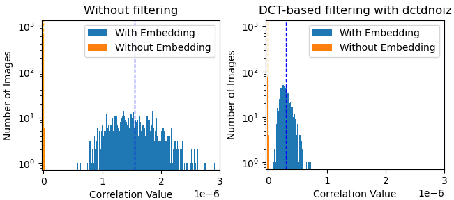

# Watermark Correlations Estimation

This repository contains Python scripts, a C++ implementation of digital watermarks, and evaluation results used in the paper *"A method for experimental estimation of correlation distribution in image watermarking."*

## Google Scholar

[Link to paper in Google Scholar](https://scholar.google.com/scholar?cluster=3380722217786160297)

The paper is also stored in the `pdf` directory.

## Annotation

This paper proposes a method for experimentally estimating the distribution of correlation in correlation-based digital image watermarking. The proposed method evaluates how distortions affect the correlations between image and embedded and non-embedded watermarks. The method involves a computational experiment using an image dataset, where correlations are measured before and after filtering for embedded and non-embedded watermarks. Applying the proposed method to a DCT based watermarking algorithm demonstrates that filtering significantly reduces the correlation with the embedded watermark, while having minimal changes for non-embedded.

**Keywords:** watermark, robustness, correlation measure.

## C++ Implementation of Watermarks Used in the Paper

The watermarking method used in the paper is:

**DCT-based watermarking**, described in *"Cox I. J. et al. Secure Spread Spectrum Watermarking for Multimedia," IEEE Transactions on Image Processing, 1997, Vol. 6, No. 12, pp. 1673-1687.*

The C++ source code for these implementations is available in the `watermarks_implementation` directory, along with build instructions in the `README.md` file.

## Python Scripts

For working with watermark, Python wrapper located in the `watermarks` directory is used. You need to update the paths to the executables compiled in the `watermarks_implementation` directory within these scripts.

Python scripts operate on images located in the `images` directory. The images used in the paper are from:  
*"Rashtchian C. et al. Collecting image annotations using amazon’s mechanical turk //Proceedings of the NAACL HLT 2010 workshop on creating speech and language data with Amazon’s Mechanical Turk. – 2010. – С. 139-147."*

The scripts include:

- **`main.py`** – Runs the complete processing pipeline.  
- **`embed_watermarks.py`** – Embeds watermarks into images from the `images` directory.  
- **`calc_correlations.py`** – Calculates correlation values for the image dataset and stores the results in a `.csv` file.  
- **`filter_watermarks.py`** – Applies filters to the watermarked images according to Algorithm 1.
- **`plot_thresholds.py`** – Visualizes the correlation distribution based on result of Algorithm 1.

## Evaluation Results

Evaluation results are stored in the `results` directory as `.csv` files and in a `result` file.

The results of evaluation can be presented in a chart form (see paper for details).

